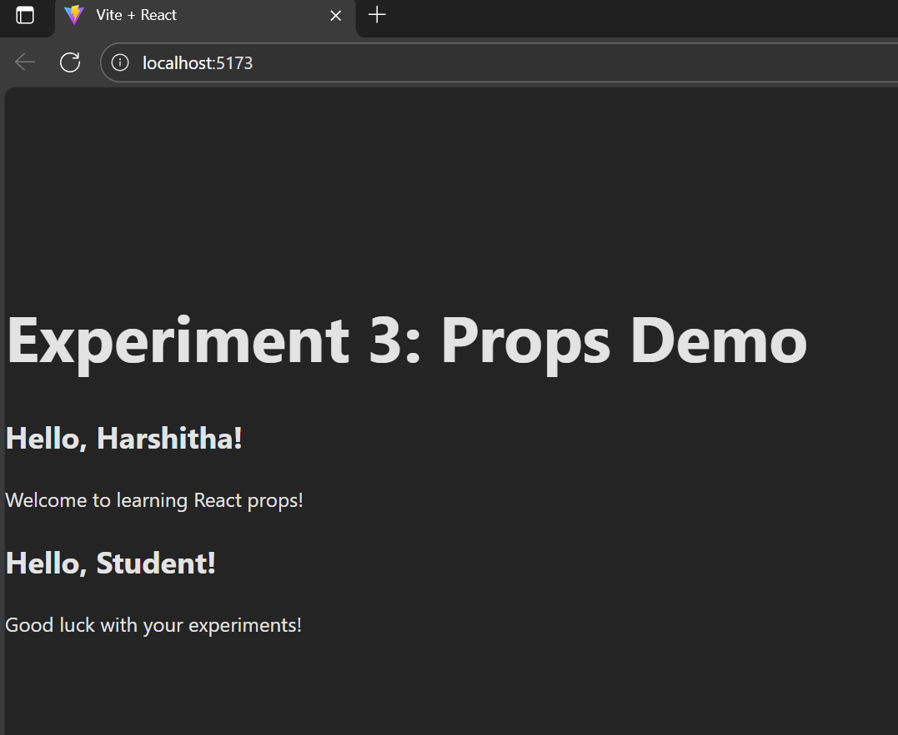

# 📘 Experiment 3: Pass data from parent to child component using props (Greeting message) (CO2)

## Steps to Run
## Screenshots

Here’s a preview of the app:



### 1. Create a new React project (if not already done)
```bash
npm create vite@latest react-props-demo
cd react-props-demo
npm install
npm install @vitejs/plugin-react --save-dev
npm run dev

